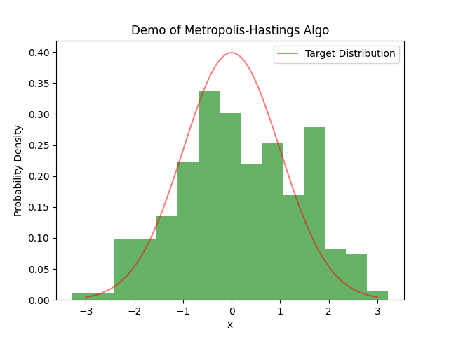
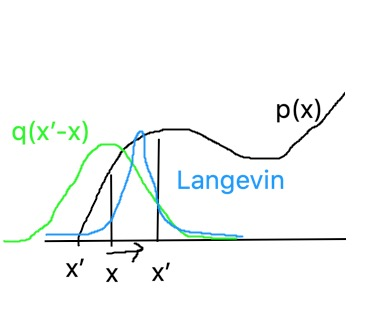

# MCMC

[TOC]

## Markov chain

transition kernel:
$K(X=x, A)=P_x(A)$

transition matrix: $K_{ij}$

### Concepts

only for discrete cases!

- irreducible: for $i,j$ exists $n$, $K^n_{ij}>0$ (connect/communicate $i\to j$)
- recurrent(resp. transient): for $i$, $\sum_n K^n_{ii}=\infty$(resp. $<\infty$) iff $E(\sharp\{x_n=i\}|x_1=i)=\infty$ iff $P(\eta_i=\sharp\{x_n=i\}=\infty|x_1=i)=1$
- positive: exists $\pi K=\pi$
- ergodic: exists unique $\pi$

*Facts.*
1. irrducible => recurrent xor transient
2. positive => recurrent
3. irrducible => positive iff $E_i\tau_i<\infty$ ($\pi_i=\frac{1}{E_i\tau_i}$ )

### invariant distr.
*Definition*
distr.: $X_{n+1}| X_n$
transition kenerl: $K$

**Detail balance condition**: $K(y,x)f(x)=K(x,y)f(y)$

*Theorem*
$X_n$: $K$-chain, satisfies DBC with PDF $\pi$ ==>
1. $\pi$ is inv. density of $X_n$ ($\pi K=\pi$)
2. $X_n$: reversible

*Fact*
$X_n$: $K$-chain, with inv. density $\pi$ ==>
$$
\|K^n\circ \mu-\pi\|_{TV} \searrow 
$$

*Theorem*
$X_n$: $K$-chain, with inv. density $\pi$ ==>
1. descrete: positive recurrent aperiodic
$$
\|K^n_x-\pi\|_{1} \searrow 0
$$
2. continuous: Harris positive and aperiodic
$$
\|K^n\circ\mu-\pi\|_{TV} \searrow 0
$$


### Metropolis-Hastings Algo.

MCMC algo. for target distr. $p(x)$

*M-H Algo*

for $p(x)$,
set proposal proba $q(y|x)$
1. initialize $x_1$
2. for $t=1,2,\cdots$

   - sample $x_{t+1}\sim q(\cdot|x_t)$
   - compute accept proba $a=a(x_t,x_{t+1})$ where $a(x,y):=\min \{\frac{q(x|y)p(y)}{q(y|x)p(x)},1\}$
   - update
   $$x_{t+1}|x_t =\begin{cases}
      x_{t+1},& a\\
      x_t, & 1-a
   \end{cases}$$

*Remark* M-H is an accept-reject precedure for Markov chain.

*Remark* An alternation of accept proba $a(x,y)=\frac{1}{1+\frac{q(y|x)p(x)}{q(x|y)p(y)}}$ (Boltzmann algo.)

*Remark* $p(y) \ll q(y|x)$ for all $x$

- **Independant chain M-H**: $q(y|x)=q(y)$, and $a(x,y):=\min\{\frac{p(y)q(x)}{p(x)q(y)},1\}$ (almost equiv. to AR method)
- **Random walk(Metropolis algo.)**: $q(y|x)=q(y-x)=q(x-y)$, and $a(x,y):=\min\{\frac{p(y)}{p(x)},1\}$
- **Gibbs sampling**: $q(y|x)=p(y|x)$, $a(x,y)=1$
- **Langevin algo./dynamics**: $y=x+\frac{\sigma^2}{2}\nabla\log p(x)+\sigma\epsilon,\epsilon\sim N(0,1)$

### Variants of M-H algo.

#### Gibbs sampling
Proposal distr.: $q(y|x)=p(y|x)$
or $q((x',y')|(x,y))=p(x'|y')p(y'|x)p(x|y)$ for $(x,y)$

*Gibbs sampling* to simulate $p(x,y)$

0. initialize $y_0$
1. $x_{t}\sim P(x|y_{t-1})$, or $P(x,y_{t-1})$
2. $y_{t}\sim P(y|x_t)$, or $P(x_{t},y)$

$(x_t,y_t)\to p(x,y), x_t\to p(x), y_t\to p(y)$

#### Random Walk

Proposal distr.: $q(x|y)=q(y|x)=q(|y-x|)$

*Random Walk Algo* 

for $p(x)$,
set proposal proba $q(|\cdot|)$
1. initialize $x_1$
2. for $t=1,2,\cdots$
   - sample $\Delta\sim q(|\cdot|)$, $x_{t+1}=x_t+\Delta$
   - compute accept proba $a=\min \{\frac{p(x_{t+1})}{p(x_{t})},1\}$
   - update
   $$x_{t+1} \leftarrow \begin{cases}
      x_{t+1},& a\\
      x_t, & 1-a
   \end{cases}$$



#### independent chain
Proposal distr.: $q(y|x)=q(y)$

accept proba: $a=\min \{\frac{p(y)q(x)}{p(x)q(y)},1\}$

#### Langevin algo.
Proposal distr. $q(y|x)=x+\frac{\sigma^2}{2}\nabla \log p(x)+\sigma\epsilon,\epsilon\sim N(0,1)$



#### Hit-and-Run

*Algo*
1. init $x_0\in\R^n$
2. loop $t=0,1,\cdots$
   - $d_t\sim S^{n-1}$
   - Let $\Omega:=\{\lambda|x_t+\lambda d\}$
   - $\lambda\sim g(\lambda|d_t,x_t),\lambda\in\Omega$
   - $x'=x+\lambda d$, $x_{t+1}=\begin{cases}x' & a(x'|x_t)\\
   x_t, & else \\
   \end{cases}$

## RJ MCMC

Background: **model selection**, select the optimal model, for data $D$ from
$$
p_k(x|\theta_k),k=1,\cdots,K
$$
Problem: to simulate $p(k,\theta_k|D)$.

Simulation Model:
- Target distr: $p(k,x_k)\propto p_k(x_k)\pi_k$ (mixed model of $p_k(x_k)$), $d_k:=\dim x_k$
- Sample sp.: $\bigcup_k(\{k\}\times \mathcal{X}_k)$

*RJMCMC algo.*
Setting proposal distr. $q(u|x_k,k,k')$ and jump distr. $j$
1. init. $k, x_k$
2. select a model: $k'\sim j(k'|k)$ (jump)
3. sample $u\sim q(u|x_k,k,k')$ ($u$ matches the dim of $x_k$)
4. compute acceptance proba.
  $$
  \alpha = \min\{JA, 1\}\\
  J = \det Jg(x_k,u), A=\frac{\pi_{k'}p(x'_{k'}|k)}{\pi_{k}p(x'_{k'}|k)}\frac{P(x_k,u|x'_{k'},u')}{P(x'_{k'},u'|x_k,u)} 
  $$
where 
$g:x_k, u\mapsto x'_{k'}, u'$: 1-1, DBC:$d_k+\dim u = d_{k'}+ \dim u'=d$

Selecting proba.: $\hat p(k)\sim \sharp\{k_t=k\}$.

### Carlin-Chib Algo.

$p(k,\theta)=p(\theta_k|k)p(u|\theta_k,k)p(k)$

*Metropolized Carlin-Chib Algo.*
1. $k^*,\theta\sim q(k^*,\theta|k,\theta)$
2. accept $k^*,\theta$ by $\alpha=\min\{\frac{p(k^*,\theta^*)q(k,\theta|k^*,\theta^*)}{p(k,\theta)q(k^*,\theta^*|k,\theta)},1\}$


## Missing data model

observable var: $x$, hidden/laten var: $z$

1. model: $p(x,z|\theta)$​​​, completed data likelihood $L^c(\theta)$​​,​
2. marginal likelihood: $l(\theta)=\int p(x|z,\theta)p(z|\theta)dz$​​
3. optimisation:  $\max_\theta l(\theta)$

in EM algo, we use likelihood $Q(\theta',\theta):=\int p(z|x,\theta')\ln p(x,z|\theta) dz$​​​​


**Gibbs sampling**

1. initalize $\theta^{(0)}$

2. $z_i^{(t+1)}|x,\theta^{(t)} \sim p(z_i|z_{-i},x,\theta^{(t)})$ i=1,2,...​​​ (as E step in EM)
3. $\theta^{(t+1)}|x, z^{(t+1)}\sim p(\theta^{(t+1)}|x, z^{(t+1)})$ (as M step in EM)

4. until it converges to  $p(\theta|x)$, (include $p(z,\theta|x)$,$p(z|x)$)

*Example.* Censored data (from references)

draw $n$​​​​​ samples $y\sim N(\mu, 1)$​​​​​​​​ iid, where $m$​​ samples $y_i<a$​​ are observed, while other $n-m$​​​​​ samples that $y_i\geq a$​​​​​ are censored. How to estimate $\mu$​​​​​​​?

<!-- x: observed samples, xi ~truncated normal

z: hidden samples， xi ~truncated normal

```
graph: theta -> y -> x, z
``` -->

*Remark.* though $y$​​ is iid, but $x,z$​​ are not independent (up to $\mu$)!​​​ :scorpion:

`P(x)=P(y=x|y<a)`

$$
P(x,z|\mu,m)\sim \prod_{i=1}^m\phi(x_i-\mu)\prod_{i=m+1}^n\phi(z_i-\mu),\\
x\in (-\infty,a)^m, z\in[a,+\infty)^{n-m},m=0,\cdots n\\
P(x,z|\mu)\sim \sum_m P(x,z|\mu,m)P(m|\mu)=P(z|m(x),\mu)P(x|\mu)\\
P(x,z,m|\mu)=P(x|\mu,m)P(z|m,\mu)P(m|\mu)
$$
where $\phi$ is Gauss function.

*Remark.* It could not be solved by EM. $Q(\mu',\mu)\propto\int_a^\infty \phi(z-\mu')\ln \phi(z-\mu) \mathrm{d}z$.

*Gibbs sampling algo.*

input $x$ ($m$ is the dim. of $x$);
output $\mu$

0. initalize $\mu^{(0)}=0$​
1. $z^{(t+1)}_i|\mu^{(t)} \sim \phi(z_i,\mu^{(t)}),z_i\geq a,i=m+1,\cdots n$​​​​
2. $\mu^{(t+1)}|x, z^{(t+1)}\sim N(\frac{m\bar{x}+(n-m)\bar{z}^{(t+1)}}{n},\frac{1}{n})$​​​​​

until it converges to $p(z,\mu|x)$ or $p(\mu|x)$​​

## Sequ


## Application

### Model

observable input var $x$​ and output var $y$​, hidden output var $z$​​​


1. model: $p(x,y|\theta)$​​​

2. likelihood: $l(\theta)=\int p(x,y|\theta) p(z|x,y,\theta)dz$

   sample form $l(\theta)=\prod_ip(x_i,y_i|\theta)\int \prod_ip(x_i'|\theta) \prod_ip(z_i|x_i',\theta)dz_1\cdots dz_m=l_1(\theta)l_0(\theta)$​​

3. optimisation:  $\max_\theta l(\theta)$


*remark* one could not do semi-supervised learning only with conditional distr. $p(y|x,\theta)$


Gibbs sampling with priori distr. $\pi(\theta)$

0. initalize $\theta^{(0)}$

1. $z^{(t+1)}|x_0,\theta^{(t)} \sim p(z|x_0,\theta^{(t)})\sim p(x_0,z|\theta^{(t)})$​
2. $\theta^{(t+1)}|x,y,x', z^{(t+1)}\sim P(\theta|x_1,y,x_0, z^{(t+1)})\sim P(x_1,y,x_0, z^{(t+1)}|\theta)\pi(\theta)\sim P(x_1,y|\theta)P(x_0, z^{(t+1)}|\theta)\pi(\theta)$

until it converges to $p(z,\theta|x,y,x')$ or $p(\theta|x,y,x')$​​


### Example

#### data complete (Gaussian distr.)

Model:
$x=(x_1,x_z)\sim N(0,\Sigma)$​​​​​, $P=\Sigma^{-1}$​​​

It is recommended to set priori distr. $\Sigma\sim IW$​​​

*Algo*
Input $x_1$

0. initalize $\Sigma^{(0)}$​
1. $z^{(t+1)}|x_1,\Sigma^{(t)} \sim N(-\Sigma_{zz}^{(t)}P_{zx_1}^{(t)}x_1, (P_{zz}^{(t)})^{-1})$​​
2. $\Sigma^{(t+1)}|x_1, z^{(t+1)}\sim IW$​​​​​​​

until it converges to $p(z,\Sigma|x_1)$​​​​


#### data imputing with PCA

model:
$x=(x_1,z)\sim N(0,V\Sigma V^T)$​​​​​​​, $P=\Sigma^{-1}$​​​​​ 
or $xV\sim N(0,\Sigma)$ where $V:p\times r$ $\Sigma$: $r$-diag

*Algo*
Input $x_1$

0. initalize $\Sigma^{(0)},V_0$​​
1. $z^{(t+1)}|x_1,\Sigma^{(t)} \sim N(-(P_{zz}^{(t)})^{-1}P_{zx_1}^{(t)}x_1, (P_{zz}^{(t)})^{-1})$​​​
2. get $V_{t+1}$​​​​​  by applying PCA to complete data
3. $\Sigma^{(t+1)}\sim IW$​​​​​​​​

until it converges to $p(z,\Sigma|x_1)$ or $p(z|x_1)$​​​​


### Experiment

`semisupervised.py`


## Mixture model

$p(x)=\sum_kp_kp(x|\theta_k)$​​

Gibbs sampling

0. initalize $\theta_k^{(0)},p_k^{(0)}$​​​

1. $c^{(t+1)}|x,\theta^{(t)} \sim P(c|x,\theta^{(t)})\sim \{k:p_kp(x|\theta_k)\}$​​​
2. $\theta^{(t+1)}|x, c^{(t+1)}\sim P(\theta|x, c^{(t+1)})$​​​​
3. $p^{(t+1)}|x, c^{(t+1)}\sim P(p|x, c^{(t+1)})$​

until it converges to $p(c,\theta|x)$​​


*References*

1. Christian P. Robert, George Casella. Monte Carlo Statistical Methods. Springer, 2004.
2. 刘金山 夏强, 基于MCMC算法的贝叶斯统计方法, 科学出版社, 2016.
3. CHRISTOPHE ANDRIEU et. al. An Introduction to MCMC for Machine Learning. Machine Learning, 50, 5–43, 2003.


*Homework*

- Transition Kernel of Boltzman algo. satisfies details balance condition.

- Compute the acceptance proba. of Langevin dynamics.
