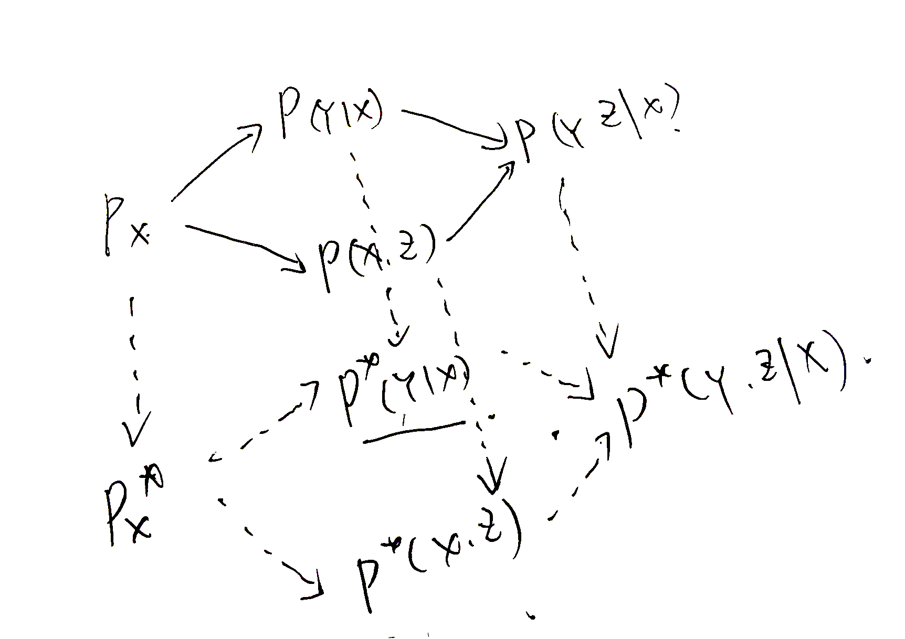

# Review

[TOC]

## Statistics

Core concepts:
- Population: a distr., $P$
- Sample: a part of population, $x_1,\cdots,x_N\sim P$(sampling)

## Statistical Model

Statistical Model: a family of probability sp. $\mathcal{F}$ (hypothisis sp.)

Parameterized form:
$$
(\mathcal{X}, P(X|\theta),\Theta)
:\Theta \to \mathcal{F}$$

### Statisitc/Estimator
task: hypothisis sp. -> real distr.

$\hat{\theta}(X)$: statistic of $X$, as an estimator for $\theta$, where $\hat{\theta}(\cdot):\mathcal{X}\to \Theta$

The main method of estimation, MLE: $\max_\theta \log p(x|\theta)$

for iid samples $x_1,\cdots x_N$,

$$
  \max_\theta \sum_i\log p(x_i|\theta)
$$

### Sampling/Generating
$X\sim P_\theta$


### Predict
- $x^*=E(X)$ for continuous rv;
- $x^*=Mode(X)$ for discrete rv; 

to predict = to estimate a rv by another rv

Predict Error:
crv:
$$
EPE:=E|X-\hat{X}|^2\\
= (EX-E\hat{X})^2 + var \hat{X} + var X
$$

drv is based on:
$$P(\hat X\neq X)$$


## Statistical Learning
- machine learning == statistical learning
- statistical learning == conditional statistics

Machine learning model:
1. relation: $y\sim f(x, w)$
2. data: $\{(x_i,y_i)\}$
3. error/loss: $\frac{1}{N}\sum_i|y_i-\hat{y}_i|^2$(MSE)

### Models
statistical learning model as a machine learning model:
1. distr.: $P(Y|X)$
2. sample: $\{(x_i,y_i)\}$
3. likelihood:
   - LL: $\sum_i\log p(y_i|x_i)$
   - NLL: $-\frac{1}{N}\sum_i\log p(y_i|x_i)$

#### Discrimination Model(conditional statistical model):
$$
(\mathcal{X}\times\mathcal{Y}, P(Y|X,\theta),\Theta)
$$

CMLE: $\hat{\theta}(Y|X)$

$X$ is treated as a determinated value.

<==> stat. model
$$
(\mathcal{Y}, P(Y|X,\theta),\Theta)
$$

#### Generating Model:
$$
(\mathcal{X}\times\mathcal{Y}, P(X,Y|\theta),\Theta)
$$

JMLE: $\hat{\theta}(X,Y)$

$$ (P(Y|X,\theta),P(Y|\theta))
$$

#### Laten variable model:
$$
(\mathcal{X}\times\mathcal{Z}, P(X,Z|\theta),\Theta)
$$
where $Z$ is unobservable/the laten variable.

MMLE: $\hat{\theta}(X)$

$Z$: laten iff $\hat\theta\in \sigma(X)$

### Generating
- common generating: $X\sim P$
- generating with some info./labels/context: $X\sim P(X|c)$

### Predict

$Mode(Y|X=x)$ or $E(Y|X=x)$

Predict Error: ...

drv $\sharp\{\hat Y_i\neq Y_i\}$

## Classical Models

### Linear Regression

Gauss-Markov model
$$
Y=X\cdot \beta+\epsilon\\
\epsilon\sim N(0,\sigma^2)
$$

Discrimination model: $P(Y|X,\beta,\sigma^2)\sim N(X\cdot \beta,\sigma^2)$

conventional form: $Y=X\beta +\epsilon,\epsilon\sim N(0,\Sigma)$
where $X$ is design matrix.

#### Estimation
$$
\hat{\beta}=X^+Y\\
\hat{\sigma}^2=\frac{1}{N}\sum_i|x_i\cdot\hat{\beta} - y_i|^2
$$

### Logistic Regression (Classification)

#### 0-1 logistic regression
$Y\sim B(\mathrm{logit}(x\cdot w))$

$\frac{1}{1+e^{-x}}$

#### logistic regression
$Y\sim Cat(\mathrm{softmax}(Wx))$

### Bayesian Classifier: LDA/QDA
Decision/Discriminating function:
$$
\argmax_k P(Y=k|x)=\argmax_k \delta_k(x),x\in \mathcal{X}
$$

Bayes formula: $P(c|x)=\frac{P(x|c)P(c)}{P(x)}$

Bayes Classifier:
$$
\hat{c}=\argmax_c \ln P(c|x)=\argmax_c \ln P(x|c)+ \ln P(c)
$$

parameter-seperated form:
I. 
  $$
  (P(X|Y=k,\theta), \{\pi_k\})
  $$
II.
  $$
  (P(X|k,\theta_k),\pi)
  $$ 
III.
  $$
  (P(X|\theta),\pi)
  $$
IV.
  $$
  (P(X|\theta_k),\pi)
  $$
  

in type of III, IV, $P\in \mathcal{F}$, say $\mathcal{F}$-Bayesian classifier

#### QDA/LDA: Gaussian-Bayesian classifier

LDA:
$$
\delta_k(x):=x^T\Sigma^{-1}\mu_k-\frac{1}{2}\|\mu_k\|_{\Sigma^{-1}}^2+\ln\pi_k.
$$

$$
\hat{\pi}_k= \frac{N_k}{N},\\
\hat{\mu}_k= \frac{1}{N_k}\sum_{y_i=k}x_i,\\
\hat{\Sigma} = \frac{1}{N-K}\sum_k\sum_{y_i=k}(x_i-\mu_k)(x_i-\mu_k)^T, (\text{unbias est.})
$$

LDA-RR: Sphericalize -> PCA (transform is learned from centroids); Fisher's Problem

### Naive Bayesian(NB) Classifier

conditional indep. $p(x|c)=\prod_j p(x_j|c)$

- Categorical NB
- Multinomial NB: Naive words seq./BOW
- Bernoulli NB
- Gaussian NB

*Remark.* consider NB on variate-dim sp. $\mathcal{X}=\bigcup_k X_1\times\cdots\times X_k$

### KMeans/GMM for Clustering
minimalize the energy 
$$
W(\gamma):=\sum_{c\in C}\sum_{\gamma(x_i)=c}\|x_i-\mu_c\|^2,
$$

Kmeans algo. (Llody algo.)

GMM = laten value version of LDA/QDA
= MLE of mixed guassian distr. $\sum_k\pi_k N(x;\mu_k,\Sigma_k)$

Kmeans = limited form of GMM/FCM, $\sigma_k\to 0$ (laten value version of ?)

### PCA/ICA/NMF for dim reduction

- PCA = SVD = KL-transform: max Variance; LSA
- ICA: min MI; FastICA based on nongaussian
- NMF/NMTF/pLSA: Multiplication updating/ALS

### Laten value models/EM algo

*variation equation/inequality*
$$
\ln p(x)=F(p,q)+D_{KL}(q(z)\| p(z|x))\\
=Q(p,q)+H(q(z), p(z|x)), \\
\geq F(p,q)
$$
where
$$
F(p,q):=\int q(z)\log\frac{p(x,z)}{q(z)}dz\\
Q(p,q):=\int q(z)\log p(x,z)dz.
$$

F-function=Free energy=ELBO(variate/evidence low bounded)
; `L>=F=Q+H`

EM algo = coordinate ascend of F-function, but based on Q-function

GEM/MCEM/cEM/VEM...


### TS/HMM

TS model:
1. pop. distr. (as in common models)
2. initial distr.
3. transition distr.

```
X_1      ... X_t      X_{t+1}      ...
^            ^        ^
|        ... |        |            ...  
|            |        |            
Y_1 ---> ... Y_t ---> Y_{t+1} ---> ...  
```

HMM = latent variable models of TS = times series of GMM

- Estimation: Forward-backward algorithm
- Prediction: Vitabi algorithm (DP)

### PGM
PGM: BN/MN

## Methods

### Bayesian:
$$
P(\theta|D)=\frac{P(D|\theta)P(\theta)}{P(D)}
$$

For incremental learning:
$$
P(\theta|D, D')=\frac{P(D'|\theta)P(\theta|D)}{P(D,D')}
$$

Emperical/Hierachical Bayesian

### Kernel:
*Theorem.*
char. function/Kernel = positive definite(Mercer) kernel = RHKS

A special type: conv.(sym.) kernel

kernel trick:
- $XX^T=\{\langle x_i,x_j\rangle\}\overset{\phi}{\Longrightarrow}\{K(x_i,x_j)\}$ (sample inner product problem)
- $X^TX \Longrightarrow XX^T$ by duality (Gramian Problem)

### Neural Networks:
approximate $P(Y|X)$ (or just $P(X)$) by a neural netowrk
- Regressor: $Y = f(X)+\epsilon$
- Classifier: $Y\sim Cat(f(X))$, where $f$ is implemented by a neural network.

Structure:
- Perceptron (Logistic Regression)
- Multi-layer NN
- CNN/Deep learning
- RNN/LSTM

## Other methods
- Hierachical Model
- Localization

## Ensemble methods

- Bagging
- Boosting
- HoE

## Software
scikit-learn, statsmodels, R/rpy2, PyMC4, TensorFlow-Probability 

## Summary ✌🏻
<center>The Beginners' Magic Cube</center>



---

1. What is a biLSTM (bidirection LSTM)?

*References*

1. J. Shao. Mathematical Statistics. Springer. 2003
2. ESL
3. Q. Ji. Probabilistic Graphical Models for Computer Vision. 2021.
4. PETER MCCULLAGH WHAT IS A STATISTICAL MODEL? The Annals of Statistics. 2002, 30(5): 1225–1310


