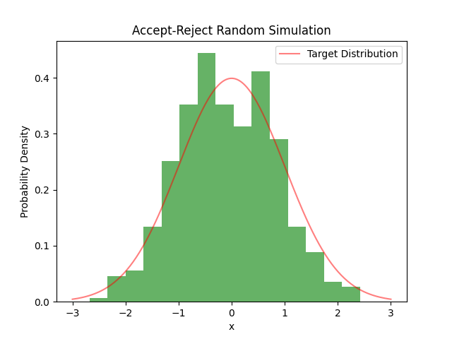

# Stochastic methods

Fundamental theory of stochastic methods for machine learning.

## Introduction
Model (generative form): $P(X,Y|\theta)$
Task: Algo $\hat\theta(X,Y)$;
Predicate: $P(Y|X,\theta)$

Bayesian Model: $P(X,Y,\theta)=P(X,Y|\theta)P(\theta)$
==> $P(\theta|X,Y)$

*Conclusion.*
machine learning == simulate the distr. in the form $P(X,Z|S)$ where $S$ is the sample of $X$ 

## Simulation

**Simulation algo.**
$\{X_t\} \leftarrow A(p)$, where $A$ is a algo, $p$ is the target PDF, return $X_t\sim p$ (asymptotically)

$A(f):=A(f^*)$, where $f\geq 0$, $f^*:=\frac{f}{\int f}$

## Reparametrization

*Fact* $X\sim p$ ==> $f(X)\sim \frac{p(f^{-1}(x))}{|f'(x)|}$.

**Def generalizaed inverse** (only for non-decreasing function $F$)
$$
F^{-}(u):=\inf\{x| F(x)\geq u\}\\
:=\sup\{x|F(x)<u\}
$$

*Fact* If $U\sim U[0,1]$, then rv $F^{-}(U)\sim F$, where $F$ is a distr.

*Remark.* Box-Muller, Normalization Flow

## Accept-reject algo.

**instumental/proposal proba. density** $g(x)$ for $f(x)$: $f\leq Mg, M\geq 1$; easy-to-sample-from

*Fact(Fundamental thm of simulation)* $X\sim f$ iff $(X,U)\sim U(0<u<f(x))$ ($U$: auxiliary var.)

*Idea*: sampling $(X,U)$ from $0<u<f(x)\subset E\subset \Omega\times(0,+\infty)$, but reject the sample outside of $0<u<f(x)$.

*Fact* $X\sim f$ iff
$$
Y\sim g; U|Y=y\sim U[0,Mg]=U[0,1]*Mg
$$
(until $0<u<f(x)$)

$X,U$ are drew from $E=\{0<u< Mg(x)\}$ randomly.

*Fact* $X\sim f:\Omega$, ($|\Omega|<\infty, f\leq M$) iff
$$
U \sim U[0,1]*M
$$
(until $0<u<f(x)$)

*Algo*
Input target PDF $f$, instumental PDF $g$
Return a sample $\{x_t\} \sim f$
1. $x_t\sim g, u_t\sim U[0,1]$
2. $$
    \begin{cases}
    \text{accept}~ x_t, & Mg(x_t)u_t\leq f(x_t),\\
    \text{reject}~ x_t, & \text{else},
    \end{cases}
  $$
3. loop $t=1,2\cdots$



## Importance sampling

### compute expectation

*Fact.*
$$
Eh(X) = E h(Y)\frac{p_X(Y)}{p_Y(Y)}\\
\approx \frac{1}{N}\sum_{y_i\sim p_Y} h(y_i)\frac{p_X(y_i)}{p_Y(y_i)}~~\text{(unbiased form)}
\\
\approx \frac{\sum_{y_i\sim p_Y} h(y_i)p_X(y_i)/p_Y(y_i)}{\sum_{y_i\sim p_Y}p_X(y_i)/p_Y(y_i)} ~~\text{(biased form)}
\\
\approx \frac{N-1}{N}\sum_{y_i\sim p_Y}  \frac{h(y_i)p_X(y_i)/p_Y(y_i)}{\sum_{y_j\sim p_Y,j\neq i}p_X(y_j)/p_Y(y_j)} ~~\text{(biased form as left one out)}
$$
where $p_X$ is intractable but $p_Y$ is "easy-to-sample-from" and $p_X\ll p_Y$.

*Example.* esp. when $Y\sim U(\mathcal{X})$, $Eh\approx \frac{\sum_{y_i\sim p_Y} h(y_i)p_X(y_i)}{\sum_{y_i\sim p_Y}p_X(y_i)} ~~\text{(biased form)}$

*Fact.*
Introduce $k(z|y)$, we have
$$
Eh(X) = E_{x,y\sim p(x)q(y)}h(X)=Eh(Z)\frac{p(Z,Y)}{q(Z,Y)}\\
= E_{y\sim q}E_{z\sim k(z|y)}h(z)\frac{p(z)}{k(z|y)}
$$
where $q(z,y)=k(z|y)q(z)$.

### integral

*Fact.*
$$
\int h(x) = E \frac{h(X)}{p(X)}\\
\approx \frac{1}{N}\sum_{x_i\sim p} \frac{h(x_i)}{p(x_i)}\\
\approx \frac{\sum_{x_i\sim p} h(x_i)/p(x_i)}{\sum_{x_i\sim p}1/p(x_i)} ~~\text{(biased form)}
$$

*Corollary.* $A\subset\Omega$,
$$|A| = E \frac{1}{p(X)}\\
\approx \frac{1}{N}\sum_{x_i\sim p} \frac{1}{p(x_i)}\\
\approx \frac{\sum_{x_i\sim p} 1_A/p(x_i)}{\sum_{x_i\sim p}1/p(x_i)} ~~\text{(biased form)}
$$

*Advice.* $\mathrm{supp}p$ contains $A$ compactly.

### simulating a distr. by IS

*Algo.*
Return $x_i\sim p$
1. $\tilde{x}_i\sim q$
2. $\rho_i=\frac{p(x_i)}{q(x_i)}$ (normalized)
3. draw $x_i$ from $\tilde{x}_i$ using weighs $\rho_i$

## MCMC

*Principle* MCMC(p):
$X_t$: Markov chain ==> $X_t\to X^*\sim p$

## Markov Chain

## Metropolis-Hastings Algo.

*Algo. M-H*
$q(x'|x)$: proposal transition proba. $p\ll q(\cdot|x)$

0. initialize $x_0$
1. loop t=0,...
    - $x'\sim q(x'|x_t), u\sim U(0,1)$
    - 
    $$ x_{t+1}=\begin{cases}
    x',& u < \rho, \\
    x_t, & \text{else},
    \end{cases}
    $$
    where acceptance proba. $\rho(x,x'):=\min\{\frac{p(x')q(x|x')}{p(x)q(x'|x)},1\}$.


### latent var. model

model: $p(x,z|\theta)$

**Gibbs sampling for LVM**

0. initalize $\theta^{(0)}$

1. $z^{(t+1)}|x,\theta^{(t)} \sim p(z_i|x,\theta^{(t)})$​​​
2. $\theta^{(t+1)}|x, z^{(t+1)}\sim p(\theta^{(t+1)}|x, z^{(t+1)})$

3. until it converges to $p(z,\theta|x)$


*Example.* Censored data (from references)

draw $n$​​​​​ samples $y\sim N(\mu, 1)$​​​​​​​​ iid, where $m$​​ samples $y_i<a$​​ are observed, while other $n-m$​​​​​ samples that $y_i\geq a$​​​​​ are censored. How to estimate $\mu$​​​​​​​?

<!-- x: observed samples, xi ~truncated normal

z: hidden samples， xi ~truncated normal

```
graph: theta -> y -> x, z
``` -->

*Remark.* though $y$​​ is iid, but $x,z$​​ are not independent (up to $\mu$)!​​​ :scorpion:

$$
P(x,z|\mu,m)\sim \prod_{i=1}^m\phi(x_i-\mu)\prod_{i=m+1}^n\phi(z_i-\mu),\\
x\in (-\infty,a)^m, z\in[a,+\infty)^{n-m},m=0,\cdots n
$$
where $\phi$ is Gauss function.

*Gibbs sampling*

0. initalize $\mu^{(0)}=0$​

1. $z^{(t+1)}_i|m(x),\mu^{(t)} \sim \phi(z_i,\mu^{(t)}),z_i\geq a,i=m+1,\cdots n$​​​​
2. $\mu^{(t+1)}|x, z^{(t+1)}\sim N(\frac{m\bar{x}+(n-m)\bar{z}^{(t+1)}}{n},\frac{1}{n})$​​​​​

until it converges to $p(z,\mu|x)$​​


## Optimisation

$$
\max_x f(x), f(x)\geq 0
$$

*Fact*
If we have a simulation algorithm for distr. $p$, $A(p)$, then
$x^*\approx \argmax f$ iff $x_t\to x^*$ where $x_t\sim A(p^T), T\to \infty$

### Simulated Annealing

SA == optimize $f$ by RW

*Algo*

Input obj. function $h$;
output max of $h$

0. init. $x_0$ and temperature $T$
1. loop:
    - $\Delta x\sim g(x)$ ($g$ is sym. around $x_i$)
    - let $\Delta h = h(x_{i}+\Delta x)-h(x_i)$
    $$
    x_{i+1}\sim \begin{cases}
    x_i+\Delta x, & p=\min(e^{\Delta h/T},1)\\
    x_i, & 1-p
    \end{cases}
    $$
    update $T$ (decrease to 0)

*Remark* MCMC for $p(x)\sim e^{h/T}$, given $T$

### Genetic Algorithm

0. init solution set/population $\{x_i\}$
1. loop:
    - genetic operation: $\{x_i'\}=T\{x_i\}$
    - selection: $\{x_i''\}$ selected from $\{x_i'\}\cup\{x_i\}$

---

*References*
- C. P. Robert and G. Casella. Monte Carlo Statistical Methods. Springer.
- D. Bertsimas and J. Tsitsilis. Simulated Annealing, 1993.
